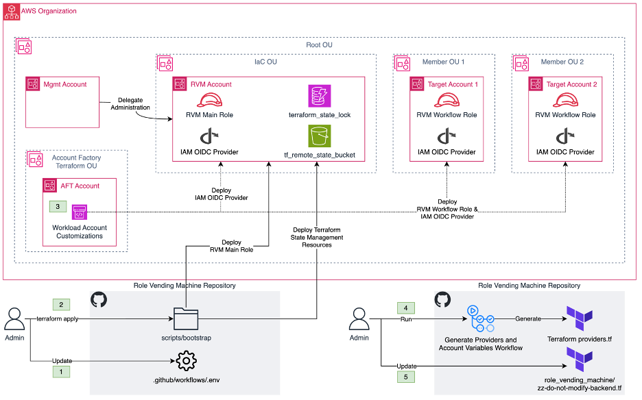

# Role Vending Machine

## Summary for Developers

Role Vending Machine (RVM) lets developers request AWS IAM Roles that can be used in their GitHub pipelines.

The high-level process steps are:
1. In a new branch, within the `role-vending-machine` subfolder, create a file named `<repo_name>.tf`.
2. Populate this Terraform file with your request using the `github-workflow-roles` module as a source (you can look at an example [here](./examples/example-security-inf-repo.tf)). There's 3 high-level components to a request:
    1. **Which GitHub repository is trusted to assume the IAM role?**
       This is specified by updating the `repository_name` parameter with your GitHub repo name.
    2. **Which account should the IAM role be deployed into?**
       This is specified by updating the `provider` block to use the account-specific provider:
        ```hcl
          providers = {
            aws = aws.Sandbox_Account
          }
        ```
    1. **Which permissions does the IAM role need?**
      This is specified by updating the `aws_iam_policy_document` data block with your required permissions and attaching it via `inline_policy = data.aws_iam_policy_document.<resource_identifier>.json`. You can also attach managed policies via ARN using the `managed_policies` parameter.
3. Make sure that your work aligns to the development standards in [development_standards](./development_standards.md). Specifically, make sure your module and resource names are unique -- we recommend using `<repo_name>-<account_name>` as a standard for the module.
4. Create your pull request, get required approval(s), and merge it!

## Additional Features and Supported Use Cases

The Role Vending Machine (RVM) solution enables developers to get the right role permissions and trust policy, while reducing the undifferentiated heavy lifting of trust policy management and role creation. Security teams can audit (or require review on) the RVM repository to ensure that best practices for IAM roles are being met. The central nature of RVM also allows for the security team to include automated code scanning into the pipeline and enforce standards (ranging from naming conventions to permission boundaries). Out of the box, RVM offers [checkov](https://github.com/bridgecrewio/checkov) scanning for Terraform templates, and [IAM Access Analyzer policy validation](https://docs.aws.amazon.com/IAM/latest/UserGuide/access-analyzer-policy-validation.html) using [IAM Policy Validator for Terraform](https://github.com/awslabs/terraform-iam-policy-validator).

RVM uses GitHub Actions to automate the role creation and deployment process. There are two main types of roles that you can create and manage using the Role Vending Machine:

- **Machine Roles**: These are roles that are intended to be used by AWS services or GitHub Actions to access resources on behalf of the service or application. They provide the necessary permissions for the service to perform its intended functions.
- **Break Glass Access Roles**: These are special roles that provide emergency or temporary access to AWS accounts, for example if your main IdP provider is experiencing an outage and you need console access to your AWS accounts.

## Machine roles

RVM allows developers to create roles for three different types of principals: GitHub pipelines, EKS pods, and other AWS services. Developers will commit Terraform files outlining required permissions and other essential details for their workload to RVM repository. When they create a pull request, a GitHub workflow initiates a Terraform plan to summarize the deployment changes, scans the Terraform template using Checkov, validates the submitted IAM policies against [IAM Access Analyzer policy check references](https://docs.aws.amazon.com/IAM/latest/UserGuide/access-analyzer-reference-policy-checks.html), and adds this information to the pull request. Following a review and approval, and after merging the pull request, another workflow executes the Terraform apply command to deploy the proposed role in the target AWS account.


## Break Glass Access Roles

Break glass access refers to a quick, emergency means for a person who does not normally have access privileges to certain AWS accounts to gain access in exceptional circumstances. This is done by using an approved process, similar to breaking the glass to trigger a fire alarm. The key use cases for break glass access include:

- Failure of the organization's identity provider (IdP)
- Security incidents involving the organization's IdP(s)
- Failures with IAM Identity Center
- Disasters resulting in the loss of the organization's cloud or identity management teams


The Role Vending Machine takes a unique approach to managing break glass access, rather than creating dedicated break glass user accounts and roles in each AWS account. Instead, it:

- Creates a role with the requested permissions when break glass access is needed, deploying it directly in the target account.
- Emails a temporary console sign-in URL to the requester upon approval of the role creation. This URL is valid for only 15 minutes and does not require a username or password.

This approach has several advantages over traditional break glass methods:

1. Reduces the attack surface and operational overhead of managing break glass user and roles across all accounts.
2. Ensures the break glass role is provisioned with only the permissions approved by the security team, applying the principle of least privilege.
3. Provides a streamlined, secure way to grant emergency access without requiring user credentials.

> [!NOTE]
> The maximum console session time for these break glass roles is limited to 1 hour, due to role chaining limitations.
> view "Additional resources" section of [IAM Roles](https://docs.aws.amazon.com/IAM/latest/UserGuide/id_roles.html#iam-term-role-chaining) on AWS documentations for more information.

> [!CAUTION]
> Be careful with this repository! RVM is inherently very powerful and you should add branch protection and PR reviews to ensure that unwanted changes are not made.
> Learn more about branch protection [here](https://docs.github.com/en/repositories/configuring-branches-and-merges-in-your-repository/managing-protected-branches/about-protected-branches).

## Prerequisites

Before deploying RVM, ensure you meet the following prerequisites:

- A GitHub Organization (GitHub Enterprise/Premium/Ultimate are not required.)
- A multi-account AWS environment (does not need to be part of AWS Organizations)
- A mechanism for deploying an IAM role used by Role Vending Machine in all AWS accounts (e.g., AFT, StackSets)
- Terraform (v1.3+)
- AWS Terraform Provider (v4+)

## Getting started

### Step 1: Download or clone the repository

1. Begine by cloning this repository.
2. Remove remote references from your cloned repository.
3. Follow the guide [here](https://docs.github.com/en/get-started/getting-started-with-git/managing-remote-repositories#adding-a-remote-repository) to add your repository as a remote repository.
4. Follow the guide [here](https://docs.github.com/en/get-started/using-git/pushing-commits-to-a-remote-repository) to push the files to your organization repository.

### Step 2: Allow the Organization’s pipeline to create pull requests (PR)

This step is only necessary if you want to allow the *Generate Providers and Account Variables* workflow to create PRs. This workflow updates the Terraform providers file to include new AWS Organization’ account. Navigate to your GitHub Organization's Settings >> Actions >> General >> and select Allow the Organization’s pipeline to create pull requests. For more details, view [Managing GitHub Actions settings for a repository](https://docs.github.com/en/enterprise-server@3.10/repositories/managing-your-repositorys-settings-and-features/enabling-features-for-your-repository/managing-github-actions-settings-for-a-repository#preventing-github-actions-from-creating-or-approving-pull-requests) to learn how to allow or GitHub Actions workflows to create pull requests.

*Note*: you can create the providers manually, and skip this step.

### Step 3: Designate an AWS account for Role Vending machine and delegate required permissions

1. Select or create an account in your AWS Organization to deploy RVM resources (for example, an `IamAdmin` account).
2. If you plan to use *Generate Providers and Account Variables* workflow (recommended), you need to provide the RVM account with necessary permissions to list your organization's accounts.
  1. Log into the management account, go to the Organizations service, navigate to Settings, and then use the Delegate Policy feature to delegate permissions to your RVM account. View [Delegated administrator for AWS Organizations](https://docs.aws.amazon.com/organizations/latest/userguide/orgs_delegate_policies.html) for more information. Below is an example of the permissions required for the workflow to run properly:

```json
{
  "Version": "2012-10-17",
  "Statement": [
    {
      "Sid": "AllowRvmRead",
      "Effect": "Allow",
      "Principal": {
        "AWS": "arn:aws:iam::<YOUR RVM Account ID>:root"
      },
      "Action": [
        "organizations:ListAccounts",
        "organizations:DescribeOrganization",
        "organizations:DescribeOrganizationalUnit",
        "organizations:ListRoots",
        "organizations:ListAWSServiceAccessForOrganization",
        "organizations:ListDelegatedAdministrators"
      ],
      "Resource": "*"
    }
  ]
}
```

Replace the `<YOUR RVM Account ID>` in the policy above with RVM's account ID.

### Step 4: Prepare the repository to Bootstrap the RVM repository

Provide necessary information to prepare the repository for bootstrapping. Below is a list of files you need to modify:

1. `.github/workflows/.env`: provide RVM account ID (`TF_VAR_rvm_account_id` variable), AWS region, your GitHub organization name, and the level of IAM Access Analyzer finding that will break the pipeline. All other fields are optional to update.
2. `scripts/generate_providers_and_account_vars.py`: provide the main AWS region you operate in[^1].
3. Navigate to `bootstrap` folder under scripts folder.
   1. Update/uncomment `terraform.tfvars` file with your GitHub organization name and the default AWS region where RVM resources are deployed into.
   2. Optionally, review the variables defined in `variables.tf` file and set/uncomment any other variable values in `terraform.tfvars` file. For example, if you want to deploy Terraform backend resources deployed in the RVM account, set the value of `create_tf_state_management_infrastructure` variable to `true`. If you want to use a repo name other than "role-vending-machine" (for example, if you use underscores instead of hyphens), you can set that in `terraform.tfvars` as well. If you are changing `breakglass_role_name` and `iam_role_name` default values, ensure you change the corresponding values in `.github/workflows/.env` as well.

[^1]: IAM resources are global, of course; the Region you specify in `generate_providers_and_account_vars.py` is used to create the AWS providers in each account, this can later be used with Terraform data structures to dynamically reference the Region in your policies.

### Step 5: Bootstrap the RVM repository

The figure below shows the RVM bootstrapping process.



1. Make sure you have local credentials set up to access the RVM account.
2. From terminal, navigate to `scripts/bootstrap` folder
   1. In the context of your RVM account, run `terraform init` to initiate Terraform.
   2. Run `terraform apply`, review the changes and approve to deploy RVM resources to RVM account. This will deploy IAM Main Role, and optionally Terraform backend resources.
3. [optional, if using RVM's break glass features] Set up your SES account
   1. In the RVM Sign in to the AWS Management Console and open the Amazon SES console at [https://console.aws.amazon.com/ses/](https://console.aws.amazon.com/ses/).
   2. Select Get started from the SES console home page and the wizard will walk you through the steps of setting up your SES account.
  
### Step 6: Deploying RVM-assumable roles across the AWS Organization

1. Using a method such as AFT or StackSets, deploy the RVM Workflow Role and create an IAM OIDC provider in each account where you expect RVM to deploy roles. You can find Terraform definitions for both of these resources in `scripts/assumed_role` and `scripts/oidc_provider` folders.
    1. For example, if using AFT, you could copy the above folders into your `aft-global-customizations` repo's `terraform` folder and then update your manifests in the `terraform` folder to call the `assumed_role` and `oidc_provider` modules.
2. Note that this step includes provisioning the IAM OIDC provider to the RVM account. Subsequent steps will not be possible without the OIDC setup.

### Step 7: RVM variables and backend setup

1. Update `role_vending_machine/zz-do-not-modify-backend.tf` file with RVM Terraform backend information (note: the "do not modify" directive is aimed at developers using this repository; RVM administrators may modify these manifests).
2. Commit and push the result.
3. From your repository’s main page, click on Actions, under All Workflows sections, click on *Generate Providers and Account Variables workflow*, and run the workflow (don't just retry an existing workflow, which will use old source code and fail). This will create a PR with the Terraform providers file in your repository. Merge that pull request into your `main` branch.

### Step 8 (optional): Fine tuning RVM

With RVM, you can create IAM roles to be assumed by GitHub pipelines or AWS services with additional configurability for EKS Pod Identity roles. There are two local variables in RVM module's [main.tf](github-workflow-roles/main.tf) file allowing you to include additional conditions in the trust policy of the roles created for AWS services:

- `service_trust_policy_controls` for general AWS service roles
- `pod_trust_policy_controls` for EKS Pod Identity roles

sections below lists the variables and the condition they to role's trust policy when set true. All of the variables are of Boolean type. Click on each variable to view the condition associated with it.

#### `service_trust_policy_controls` variables

<details>

<summary>include_account_condition</summary>

```json
"Condition": {
    "StringEquals": {
        "aws:SourceAccount": <Account ID of target account>
    }
}
```

</details>

<details>

<summary>include_org_condition</summary>

```json
"Condition": {
    "StringEquals": {
        "aws:SourceOrgID": "${aws:ResourceOrgId}"
    }
}
```

</details>

#### `pod_trust_policy_controls` variables

<details>

<summary>include_source_account</summary>

```json
"Condition": {
    "StringEquals": {
        "aws:SourceAccount": <Account ID of target account>
    }
}
```

</details>

<details>

<summary>include_cluster_arns</summary>

```json
"Condition": {
    "ArnEquals": {
        "aws:SourceArn": [
            <EKS_ARN1>,
            <EKS_ARN2>
        ]
    }
}
```

</details>

<details>

<summary>include_cluster_names</summary>

```json
"Condition": {
    "StringEquals": {
        "aws:PrincipalTag/eks-cluster-name": [
            <my-cluster-1>,
            <my-cluster-2>
        ]
    }
}
```

</details>

<details>

<summary>include_cluster_namspaces</summary>

```json
"Condition": {
    "StringEquals": {
        "aws:PrincipalTag/kubernetes-namespace": [
            <namespace-1>,
            <namespace-2>
        ]
    }
}
```

</details>

<details>

<summary>include_cluster_service_account</summary>

```json
"Condition": {
    "StringEquals": {
        "aws:PrincipalTag/kubernetes-service-account": [
            <service-account-1>,
            <service-account-2>
        ]
    }
}
```

</details></br>

> [!TIP]
> EKS Pod Identity role trust conditions will be added only if the developers include these values in their role definition Terraform file. If you want to enforce inclusion of these variables, you can remove the default value of `eks_cluster_arns`, `eks_cluster_name`, `eks_namespaces`, and `eks_service_account` variables in `github-workflow-roles/variables.tf` file.

## Auto-magical `providers.tf` and `variables-accounts-<env>.tf`

To save toil and prevent human error while modifying the `providers.tf` Terraform file to include both a terraform provider definition and a terraform variable for each account.

How it works:

- A GitHub workflow called `Generate Providers and Account Variables` runs on a daily schedule
- The script at `scripts\generate_providers_and_account_vars.py` consumes JSON formatted account lists
- Provider definitions and terraform variables files are generated and an automatic PR is cut if these files need to be updated.
- Because RVM uses a separate set of roles for readonly/plan workflows, two sets of `providers.tf` files are generated: one for readonly and one for non-readonly. During plan pipeline runs, the non-readonly file should be removed. During apply pipeline runs, the readonly file should be removed. Don't remove the file manually, just run an `rm` command during the respective pipeline workflow.
